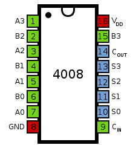

# NanoTekSpice 🔌

Welcome to **NanoTekSpice**.

A digital electronics simulator focused on logic gates and chipsets, perfect for understanding and designing electronic systems.

## Language and Tools 🛠️


- **Language:** C++
- **Compilation:** Via Makefile, including `re`, `clean`, and `fclean` rules.
- **Binary Name:** nanotekspice

## Project Overview 🔎

NanoTekSpice simulates digital electronics, including complex chipsets and microprocessors. It uses configuration files for circuit setup and provides user-driven simulations.

#### Exemple:




### Features

- **Simulate Various Chipsets:** Includes simple chipsets like the 4081 and complex functions.
- **Boolean Logic & Undefined State:** Handles true, false, and an undefined state.
- **Dynamic Circuit Construction:** Uses `.chipsets` and `.links` sections in configuration files.

### Configuration File

- `.chipsets:` Declares components.
- `.links:` Defines connections between component pins.
- Special components: `input`, `clock`, `true`, `false`, `output`.

## Components

Includes components like `AND`, `C4011`, `C4040`, `C4081`, `XOR`, `C4001`, `C4013`, `C4069`, `C4094`, `NOT`, `C4008`, `C4030`, `C4071`, `Clock`,  `OR`.

### Error Handling

- Gracefully handles lexical/syntactic errors, unknown components, and nonexistent pins.

### Execution and Commands

- Run with a circuit file as a parameter.
- Supports commands like `exit`, `display`, `input=value`, `simulate`, `loop`, `dump`.
- Interactive prompt for real-time simulation.

### Exemple

```
∼> cat -e or_gate.nts
.chipsets:$
input a$
input b$
4071 or$
output s$
.links:$
a:1 or:1$
b:1 or:2$
or:3 s:1$

∼> ./nanotekspice or_gate.nts
> b=0
> a=1
> simulate
> display
tick: 1
input(s):
a: 1
b: 0
output(s):
s: 1
> exit

∼> cat -e clock.nts
.chipsets:$
clock cl$
output out$
.links:$
out:1 cl:1$

∼> ./nanotekspice clock.nts
> display
tick: 0
input(s):
cl: U
output(s):
out: U
> cl=0
> display
tick: 0
input(s):
cl: U
output(s):
out: U
> simulate
> display
tick: 1
input(s):
cl: 0
output(s):
out: 0
> simulate
> display
tick: 2
input(s):
cl: 1
output(s):
out: 1
> simulate
> simulate
> simulate
> display
tick: 5
input(s):
cl: 0
output(s):
out: 0

~> (CTRL+D) ∼> echo $?
0
```

## Installation and Usage 💾

1. **Compile the Project:**
   - Run `make` in the project's root directory.

2. **Running the Simulator:**
   - Execute `./nanotekspice [circuit_file.nts]`.

3. **Interactive Simulation:**
   - Use commands to manipulate circuits and observe changes.

For detailed guidelines and command references, refer to `nanotekspice.pdf`.

## License

This project is under the MIT License. See `LICENSE` for details.
